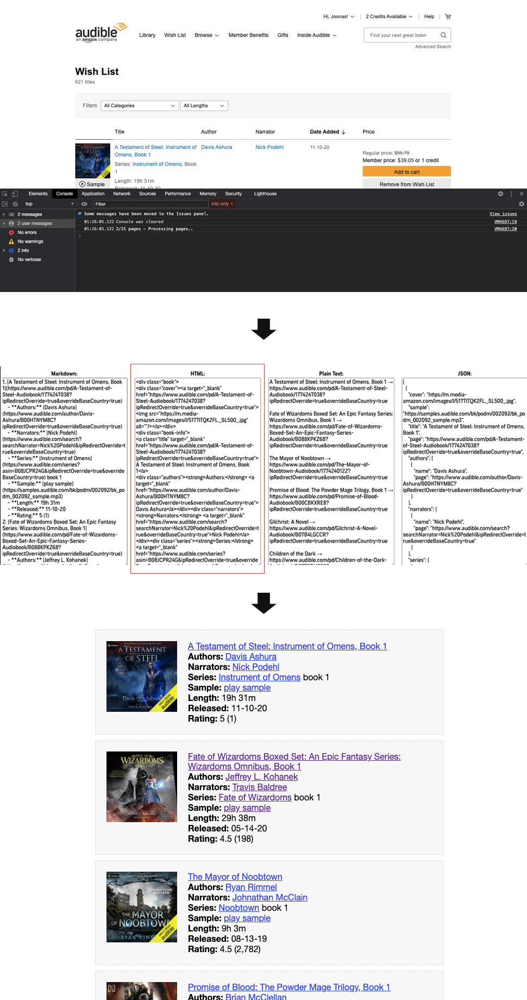

# audible wishlist scraper

Fetches your wishlist and outputs it as: html, markdown, plaintext, json.

## A word of warning

Use at your own risk. I have good intentions, but you shouldn't go copy pasting scripts into your browser's console all willy nilly. Just as a heads up, Firefox will give you this warning message when you try to paste things into the console. You should probably heed the warning:

> Firefox warning message in the console → Scam Warning: Take care when pasting things you don’t understand. This could allow attackers to steal your identity or take control of your computer. Please type ‘allow pasting’ below (no need to press enter) to allow pasting.

## Usage

> You don't need to know how to code or read any code to use this script. It would be preferrable, as stated above, but the only thing you need to know is how to copy & paste.

1. **Copy the script** `(Ctrl+C)` into your clipboard from here: [audible wishlist scraper.js](https://raw.githubusercontent.com/joonaspaakko/audible-wishlist-scraper/main/audible%20wishlist%20scraper.js)
2. **Go to your Audible wishlist page.**
	- Sort and filter the wishlist before runnign the script... if needed.
3. **Open your browser's developer tools console.** The easy way is to right click anywhere on a website, choose `Inspect element` from the context menu and then click the `Console` tab.
4. **Paste the script** `(Ctrl+V)` into the console and press enter to run it. 
  - Depending on the size of your wishlist, it may take a hot minute for it to be done, and when it is it will give you 4 textboxes with the different outputs.

## Output Example

Here's the HTML output of my wishlist: [in jsfiddle](https://jsfiddle.net/o36h7swm/show/).

I had trouble putting this anywhere because my wishlist is kinda large. I'm a terrible wishlist user. I pretty much put in anything that is vaguely intersting (or not even), like if the cover looks cool or something... In the wishlist you go!

